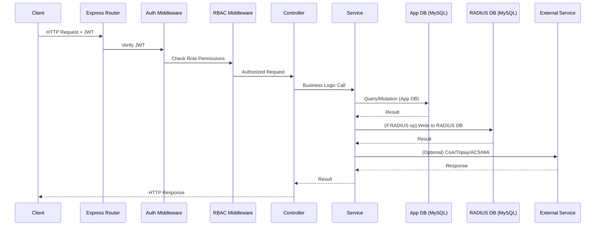
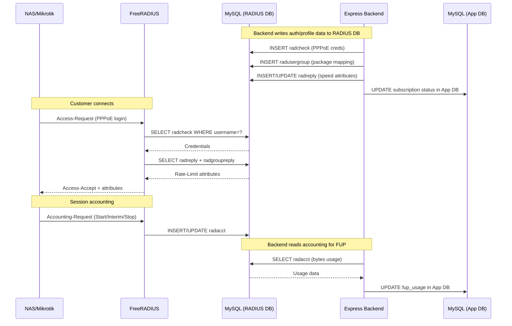
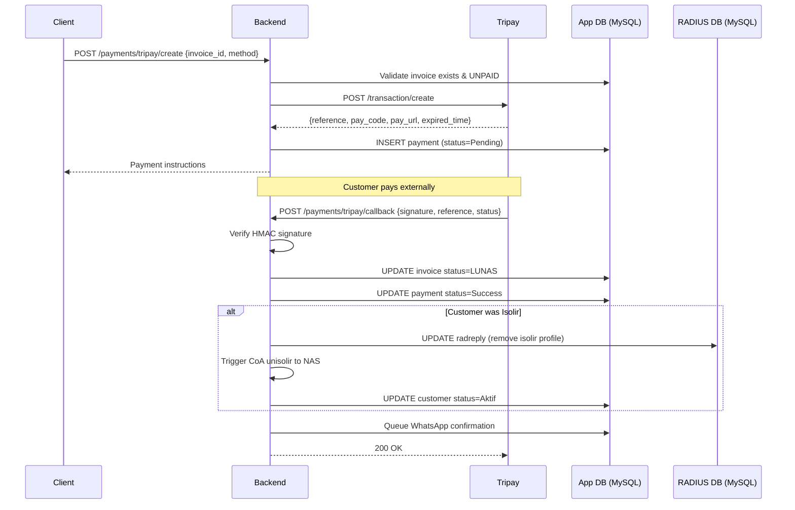
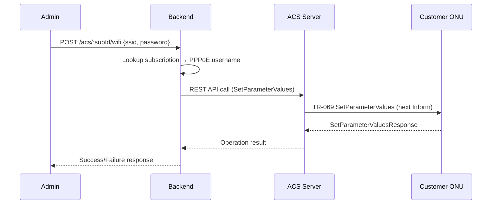
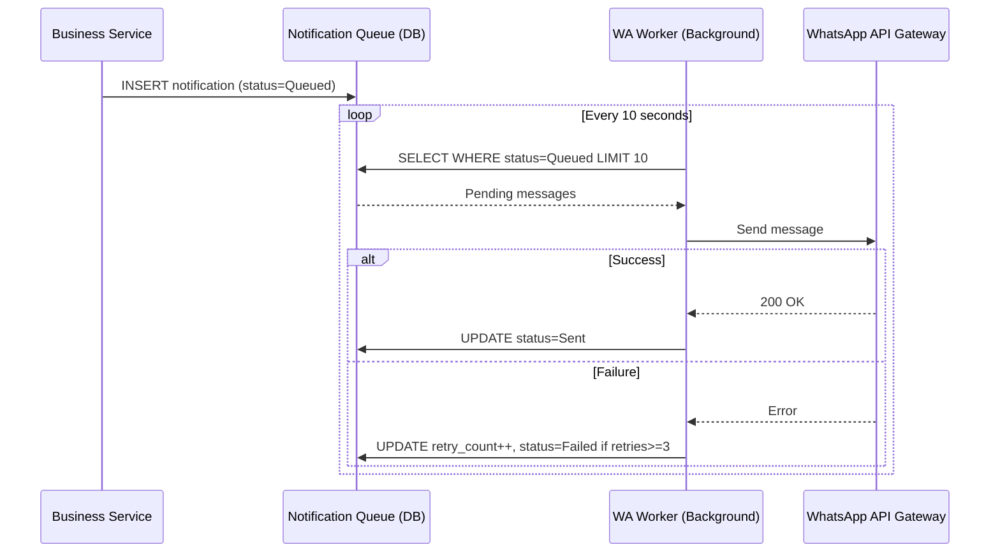
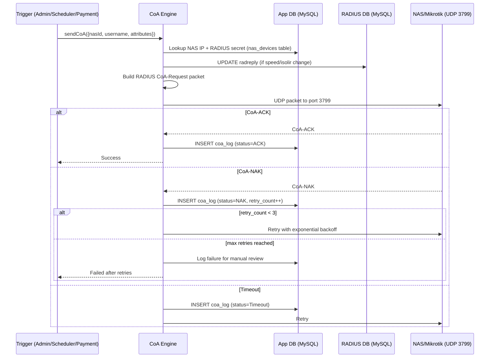
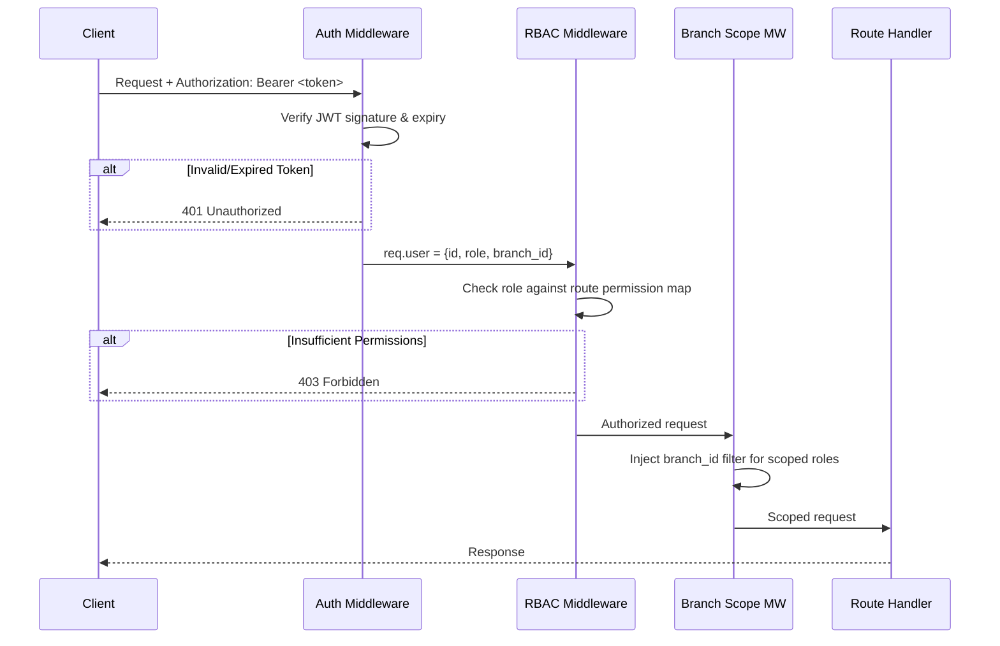

# Design Document: UwaisSuperApps ISP Backend

## Overview

UwaisSuperApps ISP Backend is a monolithic Express.js REST API server backed by MySQL and integrated with FreeRADIUS for network access control. The system manages the complete ISP business lifecycle: customer management (CRM), service provisioning, automated billing, real-time network control via RADIUS/CoA, asset/inventory tracking, helpdesk ticketing, infrastructure registration, KPI/payroll management, and regulatory reporting.

The backend serves three client applications:
- **Web Dashboard** — used by Superadmin, Admin, Accounting, Sales
- **Customer Mobile App** — used by Pelanggan (subscribers)
- **Technician Mobile App** — used by Teknisi (field technicians)

### Key Design Decisions

1. **Monolithic architecture** — Single Express.js application with modular folder structure. Chosen for simplicity of deployment and operational overhead appropriate for a regional ISP.
2. **Dual MySQL databases** — Two separate MySQL databases: (a) Application DB for all business data (customers, invoices, assets, tickets, etc.) and (b) RADIUS DB for FreeRADIUS tables (`radcheck`, `radreply`, `radacct`, `radusergroup`, `nas`). This separation keeps FreeRADIUS operating independently and allows the RADIUS DB to be tuned/scaled separately from the application DB.
3. **FreeRADIUS for AAA** — Industry-standard RADIUS server handling PPPoE authentication, accounting, and CoA/POD relay. FreeRADIUS connects exclusively to the RADIUS DB.
4. **Job scheduler (node-cron)** — In-process scheduled jobs for billing generation, auto-isolir, FUP enforcement, KPI calculation, and NAS health polling.
5. **JWT + RBAC** — Stateless authentication with role-based middleware for 8 distinct user roles.
6. **Queue-based notifications** — WhatsApp messages processed via a background queue with retry logic.

## Architecture

### High-Level Architecture Diagram

```mermaid
graph TB
    subgraph Clients
        WebDash[Web Dashboard<br/>Admin/Superadmin/Accounting/Sales]
        CustApp[Customer Mobile App<br/>Pelanggan]
        TechApp[Technician Mobile App<br/>Teknisi]
    end

    subgraph "Backend Server (Express.js)"
        API[REST API Layer<br/>Routes + Controllers]
        Auth[Auth Middleware<br/>JWT + RBAC]
        Services[Service Layer<br/>Business Logic]
        Scheduler[Job Scheduler<br/>node-cron]
        CoAEngine[CoA/POD Engine<br/>SSH to FreeRADIUS + radclient]
        NotifQueue[Notification Queue<br/>WhatsApp Worker]
    end

    subgraph "Application Database"
        AppDB[(MySQL - App DB<br/>customers, invoices, assets,<br/>tickets, users, etc.)]
    end

    subgraph "RADIUS Database"
        RadiusDB[(MySQL - RADIUS DB<br/>radcheck, radreply, radacct,<br/>radusergroup, nas)]
        FreeRADIUS[FreeRADIUS Server]
    end

    subgraph "External Integrations"
        Tripay[Tripay Payment Gateway]
        ACS[ACS Server<br/>TR-069]
        WhatsApp[WhatsApp API<br/>Gateway]
        CHR[Mikrotik CHR<br/>RouterOS 7 REST API<br/>VPN Concentrator]
        NAS[NAS/Mikrotik Routers<br/>via VPN through CHR]
    end

    WebDash --> API
    CustApp --> API
    TechApp --> API

    API --> Auth
    Auth --> Services
    Services --> AppDB
    Services -->|RADIUS writes| RadiusDB
    Services --> CoAEngine
    Services --> NotifQueue
    Scheduler --> Services

    CoAEngine -->|SSH + radclient| FreeRADIUS
    FreeRADIUS -->|CoA/POD UDP 3799| NAS
    FreeRADIUS -->|RADIUS Auth/Acct| NAS
    FreeRADIUS --> RadiusDB

    Services -->|REST| Tripay
    Services -->|TR-069/REST| ACS
    Services -->|REST API (HTTPS)| CHR
    CHR -->|VPN Tunnels| NAS
    NotifQueue -->|REST| WhatsApp
    Tripay -->|Callback| API
end
```

### Request Flow



## Components and Interfaces

### Module Structure

```
src/
├── app.js                    # Express app setup, middleware registration
├── server.js                 # HTTP server entry point
├── config/
│   ├── database.js           # Dual MySQL connection pools (App DB + RADIUS DB)
│   ├── radius.js             # FreeRADIUS RADIUS protocol config (CoA secrets, ports)
│   ├── tripay.js             # Tripay API credentials
│   ├── whatsapp.js           # WhatsApp gateway config
│   ├── acs.js                # ACS/TR-069 config
│   └── scheduler.js          # Cron schedule definitions
├── middleware/
│   ├── auth.js               # JWT verification
│   ├── rbac.js               # Role-based access control
│   ├── branchScope.js        # Branch data scoping
│   ├── validator.js          # Request validation (Joi)
│   └── errorHandler.js       # Global error handler
├── routes/
│   ├── index.js              # Route aggregator
│   ├── auth.routes.js
│   ├── customer.routes.js
│   ├── subscription.routes.js
│   ├── package.routes.js
│   ├── billing.routes.js
│   ├── payment.routes.js
│   ├── nas.routes.js
│   ├── coa.routes.js
│   ├── acs.routes.js
│   ├── asset.routes.js
│   ├── inventory.routes.js
│   ├── ticket.routes.js
│   ├── infrastructure.routes.js
│   ├── notification.routes.js
│   ├── user.routes.js
│   ├── branch.routes.js
│   ├── report.routes.js
│   ├── capex.routes.js
│   ├── kpi.routes.js
│   ├── payroll.routes.js
│   ├── selfservice.routes.js
│   └── scheduler.routes.js
├── controllers/
│   ├── auth.controller.js
│   ├── customer.controller.js
│   ├── subscription.controller.js
│   ├── package.controller.js
│   ├── billing.controller.js
│   ├── payment.controller.js
│   ├── nas.controller.js
│   ├── coa.controller.js
│   ├── acs.controller.js
│   ├── asset.controller.js
│   ├── inventory.controller.js
│   ├── ticket.controller.js
│   ├── infrastructure.controller.js
│   ├── notification.controller.js
│   ├── user.controller.js
│   ├── branch.controller.js
│   ├── report.controller.js
│   ├── capex.controller.js
│   ├── kpi.controller.js
│   ├── payroll.controller.js
│   ├── selfservice.controller.js
│   └── scheduler.controller.js
├── services/
│   ├── customer.service.js
│   ├── subscription.service.js
│   ├── package.service.js
│   ├── billing.service.js
│   ├── payment.service.js
│   ├── tripay.service.js
│   ├── mitra.service.js
│   ├── merchant.service.js
│   ├── nas.service.js
│   ├── coa.service.js
│   ├── radius.service.js
│   ├── acs.service.js
│   ├── asset.service.js
│   ├── inventory.service.js
│   ├── ticket.service.js
│   ├── infrastructure.service.js
│   ├── notification.service.js
│   ├── whatsapp.service.js
│   ├── user.service.js
│   ├── branch.service.js
│   ├── report.service.js
│   ├── capex.service.js
│   ├── kpi.service.js
│   ├── payroll.service.js
│   ├── coverage.service.js
│   ├── fup.service.js
│   └── prorata.service.js
├── jobs/
│   ├── index.js              # Job registry and scheduler init
│   ├── billingGeneration.job.js
│   ├── autoIsolir.job.js
│   ├── nasHealthPoll.job.js
│   ├── kpiCalculation.job.js
│   ├── fupEnforcement.job.js
│   └── notificationBroadcast.job.js
├── models/
│   ├── index.js              # Model registry (App DB models)
│   ├── customer.model.js
│   ├── subscription.model.js
│   ├── package.model.js
│   ├── invoice.model.js
│   ├── payment.model.js
│   ├── nas.model.js
│   ├── coaLog.model.js
│   ├── asset.model.js
│   ├── assetTransfer.model.js
│   ├── toolLending.model.js
│   ├── directSale.model.js
│   ├── stockOpname.model.js
│   ├── ticket.model.js
│   ├── ticketJournal.model.js
│   ├── olt.model.js
│   ├── odp.model.js
│   ├── notification.model.js
│   ├── user.model.js
│   ├── branch.model.js
│   ├── capexProject.model.js
│   ├── kpi.model.js
│   ├── overtime.model.js
│   ├── payroll.model.js
│   ├── fupUsage.model.js
│   ├── jobLog.model.js
│   └── auditLog.model.js
├── radiusModels/
│   ├── index.js              # RADIUS DB model registry
│   ├── radcheck.model.js     # PPPoE credentials
│   ├── radreply.model.js     # Per-user reply attributes
│   ├── radgroupcheck.model.js
│   ├── radgroupreply.model.js
│   ├── radusergroup.model.js # User-to-group mapping
│   ├── radacct.model.js      # Accounting records
│   └── nas.model.js          # NAS registry for FreeRADIUS
├── utils/
│   ├── pppoeGenerator.js     # PPPoE username/password generation
│   ├── snGenerator.js        # Serial number auto-generation
│   ├── prorataCalc.js        # Prorata billing calculation
│   ├── fupCalc.js            # FUP threshold calculation
│   ├── coaPacket.js          # CoA/POD UDP packet builder
│   ├── mikrotikScript.js     # NAS config script generator
│   ├── excelExport.js        # Excel file generation (exceljs)
│   ├── pdfExport.js          # PDF report generation
│   ├── phoneValidator.js     # Indonesian phone number validation
│   ├── gpsDistance.js        # Haversine distance calculation
│   └── constants.js          # Enums, status values, config constants
└── tests/
    ├── unit/
    ├── integration/
    └── property/
```

### API Endpoint Design (by Module)

#### Authentication (`/api/auth`)
| Method | Endpoint | Roles | Description |
|--------|----------|-------|-------------|
| POST | `/api/auth/login` | Public | Login, returns JWT |
| POST | `/api/auth/refresh` | Authenticated | Refresh JWT token |
| POST | `/api/auth/password-reset/request` | Public | Request password reset |
| POST | `/api/auth/password-reset/confirm` | Public | Confirm password reset with token |

#### Customers (`/api/customers`)
| Method | Endpoint | Roles | Description |
|--------|----------|-------|-------------|
| GET | `/api/customers` | Admin, Accounting, Sales, Mitra | List customers (Branch-scoped) |
| GET | `/api/customers/:id` | Admin, Accounting, Sales, Mitra, Teknisi | Get customer detail |
| POST | `/api/customers` | Admin, Sales, Mitra | Create new customer |
| PUT | `/api/customers/:id` | Admin | Update customer data |
| PATCH | `/api/customers/:id/status` | Admin | Change lifecycle status |
| GET | `/api/customers/:id/audit-log` | Admin, Superadmin | Get status change history |

#### Subscriptions (`/api/subscriptions`)
| Method | Endpoint | Roles | Description |
|--------|----------|-------|-------------|
| GET | `/api/subscriptions` | Admin | List subscriptions (Branch-scoped) |
| GET | `/api/subscriptions/:id` | Admin, Teknisi | Get subscription detail |
| POST | `/api/subscriptions` | Admin | Create subscription for customer |
| PUT | `/api/subscriptions/:id` | Admin | Update subscription |
| POST | `/api/subscriptions/:id/activate` | Admin | Activate PPPoE on NAS |
| POST | `/api/subscriptions/:id/installation` | Teknisi | Submit installation data |

#### Packages (`/api/packages`)
| Method | Endpoint | Roles | Description |
|--------|----------|-------|-------------|
| GET | `/api/packages` | All Authenticated | List packages |
| GET | `/api/packages/:id` | All Authenticated | Get package detail |
| POST | `/api/packages` | Superadmin | Create package |
| PUT | `/api/packages/:id` | Superadmin | Update package |
| DELETE | `/api/packages/:id` | Superadmin | Delete package (if no active subs) |

#### Billing (`/api/billing`)
| Method | Endpoint | Roles | Description |
|--------|----------|-------|-------------|
| GET | `/api/billing/invoices` | Admin, Accounting, Mitra | List invoices |
| GET | `/api/billing/invoices/:id` | Admin, Accounting, Mitra, Pelanggan | Get invoice detail |
| POST | `/api/billing/invoices/:id/waive` | Accounting | Waive invoice (extended isolir) |
| GET | `/api/billing/dp` | Admin | List down payments |
| POST | `/api/billing/dp` | Admin, Sales | Record down payment |

#### Payments (`/api/payments`)
| Method | Endpoint | Roles | Description |
|--------|----------|-------|-------------|
| POST | `/api/payments/tripay/create` | Pelanggan, Admin | Create Tripay payment |
| POST | `/api/payments/tripay/callback` | Public (signature verified) | Tripay webhook callback |
| POST | `/api/payments/mitra` | Mitra | Process payment via Mitra |
| POST | `/api/payments/merchant` | Merchant | Process payment via Merchant |
| POST | `/api/payments/mitra/topup` | Mitra | Top up Mitra balance |
| POST | `/api/payments/merchant/topup` | Merchant | Top up Merchant balance |
| GET | `/api/payments/mitra/balance` | Mitra | Get Mitra balance & report |
| GET | `/api/payments/merchant/balance` | Merchant | Get Merchant balance & report |

#### NAS Management (`/api/nas`)
| Method | Endpoint | Roles | Description |
|--------|----------|-------|-------------|
| GET | `/api/nas` | Superadmin, Admin | List NAS devices |
| GET | `/api/nas/:id` | Superadmin, Admin | Get NAS detail |
| POST | `/api/nas` | Superadmin | Register new NAS |
| PUT | `/api/nas/:id` | Superadmin | Update NAS |
| GET | `/api/nas/:id/script` | Superadmin | Download config script |
| POST | `/api/nas/:id/test` | Superadmin | Test NAS connectivity |
| GET | `/api/nas/monitoring` | Admin, Superadmin | NAS health status dashboard |

#### VPN CHR Management (`/api/vpn-chr`)
| Method | Endpoint | Roles | Description |
|--------|----------|-------|-------------|
| GET | `/api/vpn-chr/status` | Superadmin, Admin | Get CHR system status and resource usage |
| GET | `/api/vpn-chr/secrets` | Superadmin, Admin | List all VPN secrets (PPTP/L2TP/SSTP/OVPN) |
| POST | `/api/vpn-chr/secrets` | Superadmin | Create VPN secret on CHR |
| DELETE | `/api/vpn-chr/secrets/:id` | Superadmin | Remove VPN secret from CHR |
| GET | `/api/vpn-chr/active-connections` | Superadmin, Admin | List active VPN connections |
| POST | `/api/vpn-chr/profiles` | Superadmin | Create/update PPP profile |
| GET | `/api/vpn-chr/profiles` | Superadmin, Admin | List PPP profiles |
| GET | `/api/vpn-chr/ip-pools` | Superadmin, Admin | List IP pools |
| POST | `/api/vpn-chr/ip-pools` | Superadmin | Create IP pool |
| POST | `/api/vpn-chr/disconnect/:id` | Superadmin, Admin | Disconnect active VPN session |

#### CoA Engine (`/api/coa`)
| Method | Endpoint | Roles | Description |
|--------|----------|-------|-------------|
| POST | `/api/coa/kick` | Admin | Disconnect PPPoE session (POD) |
| POST | `/api/coa/speed-change` | Admin | Apply speed change via CoA |
| POST | `/api/coa/isolir` | Admin | Manually isolir a customer |
| POST | `/api/coa/unisolir` | Admin | Manually remove isolir |
| GET | `/api/coa/logs` | Admin, Superadmin | CoA operation logs |

#### ACS / TR-069 (`/api/acs`)
| Method | Endpoint | Roles | Description |
|--------|----------|-------|-------------|
| POST | `/api/acs/:subscriptionId/reboot` | Admin | Reboot customer ONU |
| POST | `/api/acs/:subscriptionId/wifi` | Admin, Pelanggan | Change WiFi SSID/password |
| POST | `/api/acs/:subscriptionId/firmware` | Admin | Trigger firmware update |
| GET | `/api/acs/:subscriptionId/status` | Admin | Get device status |

#### Assets & Inventory (`/api/assets`)
| Method | Endpoint | Roles | Description |
|--------|----------|-------|-------------|
| GET | `/api/assets` | Admin, Teknisi | List assets (Branch-scoped) |
| POST | `/api/assets/inbound` | Admin | Record asset inbound |
| POST | `/api/assets/outbound` | Admin | Approve asset outbound |
| POST | `/api/assets/outbound/request` | Teknisi | Request assets |
| POST | `/api/assets/return` | Teknisi | Return assets |
| POST | `/api/assets/transfer` | Admin | Initiate inter-branch transfer |
| POST | `/api/assets/transfer/:id/confirm` | Admin | Confirm transfer receipt |
| POST | `/api/assets/transfer/:id/return` | Admin | Return transfer |
| POST | `/api/assets/tools/borrow` | Teknisi | Request tool borrow |
| POST | `/api/assets/tools/:id/approve` | Admin | Approve tool borrow |
| POST | `/api/assets/tools/:id/return` | Teknisi | Return tool |
| GET | `/api/assets/tools/borrowed` | Admin | List borrowed tools |
| POST | `/api/assets/direct-sale` | Admin, Sales | Record direct sale |
| POST | `/api/assets/stock-opname` | Admin | Start stock opname |
| PUT | `/api/assets/stock-opname/:id` | Admin | Submit opname counts |
| POST | `/api/assets/stock-opname/:id/finalize` | Admin | Finalize opname |

#### Tickets (`/api/tickets`)
| Method | Endpoint | Roles | Description |
|--------|----------|-------|-------------|
| GET | `/api/tickets` | Admin, Teknisi | List tickets (Branch-scoped) |
| GET | `/api/tickets/:id` | Admin, Teknisi, Pelanggan | Get ticket detail |
| POST | `/api/tickets` | Admin, Teknisi, Pelanggan | Create ticket |
| PATCH | `/api/tickets/:id/assign` | Admin | Assign/dispatch ticket |
| PATCH | `/api/tickets/:id/progress` | Teknisi | Update ticket progress |
| PATCH | `/api/tickets/:id/resolve` | Admin | Resolve ticket |
| PATCH | `/api/tickets/:id/close` | Admin | Close ticket |
| POST | `/api/tickets/:id/journal` | Teknisi | Add journal entry |
| POST | `/api/tickets/:id/overtime` | Admin | Request overtime for ticket |
| PATCH | `/api/tickets/:id/overtime/approve` | Superadmin, Admin | Approve overtime |
| GET | `/api/tickets/reports` | Admin, Superadmin | Ticket reports |

#### Infrastructure (`/api/infrastructure`)
| Method | Endpoint | Roles | Description |
|--------|----------|-------|-------------|
| GET | `/api/infrastructure/olts` | Admin, Superadmin, Teknisi, Sales | List OLTs |
| POST | `/api/infrastructure/olts` | Superadmin | Register OLT |
| PUT | `/api/infrastructure/olts/:id` | Superadmin | Update OLT |
| POST | `/api/infrastructure/olts/:id/test` | Superadmin | Test OLT connectivity |
| GET | `/api/infrastructure/odps` | Admin, Teknisi, Sales | List ODPs |
| POST | `/api/infrastructure/odps` | Admin, Teknisi | Register ODP |
| PUT | `/api/infrastructure/odps/:id` | Admin | Update ODP |
| GET | `/api/infrastructure/coverage` | Sales, Mitra, Teknisi, Admin | Coverage check |

#### Package Change (`/api/package-change`)
| Method | Endpoint | Roles | Description |
|--------|----------|-------|-------------|
| POST | `/api/package-change/request` | Pelanggan, Sales, Mitra | Request package change |
| GET | `/api/package-change` | Admin | List pending requests |
| PATCH | `/api/package-change/:id/approve` | Admin | Approve package change |
| PATCH | `/api/package-change/:id/reject` | Admin | Reject package change |

#### Users (`/api/users`)
| Method | Endpoint | Roles | Description |
|--------|----------|-------|-------------|
| GET | `/api/users` | Superadmin | List users |
| POST | `/api/users` | Superadmin | Create user |
| PUT | `/api/users/:id` | Superadmin | Update user |
| PATCH | `/api/users/:id/status` | Superadmin | Activate/deactivate user |

#### Branches (`/api/branches`)
| Method | Endpoint | Roles | Description |
|--------|----------|-------|-------------|
| GET | `/api/branches` | Superadmin, Admin | List branches |
| POST | `/api/branches` | Superadmin | Create branch |
| PUT | `/api/branches/:id` | Superadmin | Update branch |
| PATCH | `/api/branches/:id/status` | Superadmin | Activate/deactivate branch |

#### Reports (`/api/reports`)
| Method | Endpoint | Roles | Description |
|--------|----------|-------|-------------|
| GET | `/api/reports/komdigi/packages` | Superadmin, Admin | Komdigi package report |
| GET | `/api/reports/komdigi/customers` | Superadmin, Admin | Komdigi customer report |
| GET | `/api/reports/komdigi/revenue` | Superadmin, Admin | Komdigi revenue report |
| GET | `/api/reports/financial` | Accounting, Superadmin | Financial reports |
| GET | `/api/reports/growth` | Superadmin, Admin, Sales | Customer growth report |
| GET | `/api/reports/export/:type` | Varies | Export report as Excel/PDF |

#### CAPEX (`/api/capex`)
| Method | Endpoint | Roles | Description |
|--------|----------|-------|-------------|
| GET | `/api/capex/projects` | Superadmin, Admin | List projects |
| POST | `/api/capex/projects` | Admin | Create project proposal |
| PUT | `/api/capex/projects/:id` | Admin | Update proposal |
| PATCH | `/api/capex/projects/:id/approve` | Superadmin | Approve project |
| PATCH | `/api/capex/projects/:id/reject` | Superadmin | Reject project |

#### KPI & Payroll (`/api/kpi`, `/api/payroll`)
| Method | Endpoint | Roles | Description |
|--------|----------|-------|-------------|
| GET | `/api/kpi/scores` | Superadmin, Admin | Get KPI scores |
| GET | `/api/kpi/history/:userId` | Superadmin, Admin | KPI history per employee |
| GET | `/api/payroll/reports` | Superadmin | Get payroll reports |
| PATCH | `/api/payroll/reports/:id/approve` | Superadmin | Approve payroll |
| GET | `/api/payroll/slips/:userId` | Superadmin, Admin | Get salary slip |

#### Notifications (`/api/notifications`)
| Method | Endpoint | Roles | Description |
|--------|----------|-------|-------------|
| GET | `/api/notifications/queue` | Admin, Superadmin | View notification queue |
| POST | `/api/notifications/broadcast` | Admin, Superadmin | Send broadcast message |

#### Scheduler (`/api/scheduler`)
| Method | Endpoint | Roles | Description |
|--------|----------|-------|-------------|
| GET | `/api/scheduler/jobs` | Superadmin | List scheduled jobs |
| GET | `/api/scheduler/logs` | Superadmin | Job execution history |
| POST | `/api/scheduler/jobs/:name/run` | Superadmin | Manually trigger job |


## Data Models

### Entity Relationship Diagram (Application Database - MySQL)

All business tables reside in the Application Database (`uwais_app`). The RADIUS Database is separate and contains only FreeRADIUS standard tables (see [FreeRADIUS Tables](#freeradius-tables-separate-radius-database) section below).

```mermaid
erDiagram
    branches {
        int id PK
        varchar name
        text address
        varchar contact_phone
        varchar contact_email
        enum status "Active, Inactive"
        timestamp created_at
        timestamp updated_at
    }

    users {
        int id PK
        varchar username UK
        varchar password_hash
        varchar full_name
        enum role "Superadmin, Admin, Accounting, Mitra, Sales, Merchant, Teknisi, Pelanggan"
        int branch_id FK
        enum status "Active, Inactive"
        decimal profit_sharing_pct "Mitra only"
        decimal commission_amount "Merchant only"
        decimal saldo "Mitra/Merchant balance"
        timestamp created_at
        timestamp updated_at
    }

    customers {
        int id PK
        varchar full_name
        varchar ktp_number UK
        varchar npwp_number "nullable"
        varchar whatsapp_number
        varchar email
        text address
        decimal latitude
        decimal longitude
        enum lifecycle_status "Prospek, Instalasi, Aktif, Isolir, Terminated"
        int branch_id FK
        int registered_by FK "users.id"
        timestamp created_at
        timestamp updated_at
    }

    customer_audit_log {
        int id PK
        int customer_id FK
        enum previous_status
        enum new_status
        int actor_id FK "users.id"
        timestamp changed_at
    }

    packages {
        int id PK
        varchar name
        int upload_rate_limit "kbps"
        int download_rate_limit "kbps"
        int upload_burst_limit "kbps"
        int download_burst_limit "kbps"
        int upload_burst_threshold "kbps"
        int download_burst_threshold "kbps"
        decimal monthly_price
        boolean ppn_enabled
        boolean fup_enabled
        int fup_quota_gb "nullable"
        int fup_upload_speed "kbps, nullable"
        int fup_download_speed "kbps, nullable"
        enum status "Active, Inactive"
        timestamp created_at
        timestamp updated_at
    }

    subscriptions {
        int id PK
        int customer_id FK
        int package_id FK
        varchar pppoe_username UK
        varchar pppoe_password
        int nas_id FK
        int odp_id FK
        int odp_port
        varchar onu_serial_number
        varchar onu_mac_address
        decimal install_latitude
        decimal install_longitude
        enum status "Pending, Active, Suspended, Terminated"
        timestamp activated_at
        timestamp created_at
        timestamp updated_at
    }

    invoices {
        int id PK
        varchar invoice_number UK
        int customer_id FK
        int subscription_id FK
        varchar billing_period "YYYY-MM"
        decimal base_amount
        decimal ppn_amount
        decimal installation_fee
        decimal addon_charges
        decimal dp_deduction
        decimal total_amount
        enum status "UNPAID, LUNAS, WAIVED, CANCELLED"
        date due_date
        date generation_date
        varchar waiver_reason "nullable"
        timestamp paid_at "nullable"
        varchar payment_method "nullable"
        timestamp created_at
    }

    payments {
        int id PK
        int invoice_id FK
        decimal amount
        varchar method "VA, QRIS, Minimarket, Mitra, Merchant, Cash"
        varchar tripay_reference "nullable"
        int processed_by FK "users.id - Mitra/Merchant/Admin"
        decimal admin_fee "Merchant commission"
        enum status "Pending, Success, Failed, Expired"
        timestamp paid_at
        timestamp created_at
    }

    saldo_transactions {
        int id PK
        int user_id FK "Mitra or Merchant"
        enum type "Topup, Deduction, Refund"
        decimal amount
        decimal balance_after
        varchar reference "invoice_id or topup ref"
        timestamp created_at
    }

    nas_devices {
        int id PK
        varchar name
        varchar ip_address
        varchar radius_secret
        int api_port
        int branch_id FK
        enum status "Active, Inactive"
        text vpn_accounts "JSON: 4 VPN account configs"
        text config_script "Generated Mikrotik script"
        timestamp last_poll_at
        enum poll_status "Up, Down"
        int active_sessions
        timestamp created_at
        timestamp updated_at
    }

    coa_logs {
        int id PK
        int subscription_id FK
        int nas_id FK
        enum trigger_type "SpeedChange, Isolir, Unisolir, FUP, Kick"
        text request_payload
        enum response_status "ACK, NAK, Timeout, Pending"
        int retry_count
        timestamp sent_at
        timestamp responded_at
    }

    olts {
        int id PK
        varchar name
        varchar ip_address
        int total_pon_ports
        int branch_id FK
        enum status "Active, Inactive"
        timestamp created_at
        timestamp updated_at
    }

    odps {
        int id PK
        varchar name
        decimal latitude
        decimal longitude
        int total_ports
        int used_ports
        int olt_id FK
        int olt_pon_port
        int branch_id FK
        enum status "Active, Inactive"
        timestamp created_at
        timestamp updated_at
    }

    assets {
        int id PK
        varchar product_name
        varchar brand_model
        enum category "PerangkatAktif, Kabel, Aksesoris"
        varchar serial_number UK
        varchar mac_address "nullable"
        enum status "Tersedia, Dipinjam, Terpasang, Rusak, DalamPengiriman, DibawaTeknisi"
        int branch_id FK
        int customer_id FK "nullable, when Terpasang"
        int assigned_teknisi_id FK "nullable"
        decimal quantity "meters for Kabel, pcs for Aksesoris"
        decimal remaining_quantity "for partial usage tracking"
        int inbound_id FK
        timestamp created_at
        timestamp updated_at
    }

    asset_inbounds {
        int id PK
        varchar invoice_number
        date purchase_date
        varchar invoice_file_url
        varchar supplier_name
        int branch_id FK
        int recorded_by FK "users.id"
        timestamp created_at
    }

    asset_transfers {
        int id PK
        int source_branch_id FK
        int destination_branch_id FK
        enum type "Transfer, Return"
        enum status "Pending, InTransit, Received, Returned"
        text items "JSON: list of asset IDs and SNs"
        int initiated_by FK "users.id"
        int confirmed_by FK "users.id, nullable"
        timestamp initiated_at
        timestamp confirmed_at
    }

    tool_lendings {
        int id PK
        int asset_id FK
        int teknisi_id FK "users.id"
        int branch_id FK
        date borrow_date
        date expected_return_date
        date actual_return_date "nullable"
        enum status "Requested, Approved, Active, Returned, Lost"
        varchar condition_on_return "nullable"
        int approved_by FK "users.id, nullable"
        timestamp created_at
    }

    direct_sales {
        int id PK
        int customer_id FK
        int branch_id FK
        int sold_by FK "users.id"
        enum payment_method "Cash, Hutang"
        decimal total_amount
        text items "JSON: list of items with SN"
        enum payment_status "Lunas, Piutang"
        timestamp created_at
    }

    stock_opnames {
        int id PK
        int branch_id FK
        int conducted_by FK "users.id"
        enum status "InProgress, Completed"
        text adjustments "JSON: discrepancies and adjustments"
        timestamp started_at
        timestamp completed_at
    }

    tickets {
        int id PK
        int customer_id FK
        int subscription_id FK "nullable"
        varchar issue_description
        enum source "Pelanggan, Teknisi, Admin"
        enum priority "VIP, High, Normal, Low"
        enum status "Open, InProgress, Pending, Resolved, Closed"
        int assigned_teknisi_id FK "nullable"
        int branch_id FK
        varchar resolution_type "nullable: RemoteFix, FieldFix"
        varchar damage_classification "nullable"
        timestamp created_at
        timestamp resolved_at
        timestamp closed_at
        int closed_by FK "nullable, users.id"
    }

    ticket_journals {
        int id PK
        int ticket_id FK
        int teknisi_id FK "users.id"
        text description
        text photo_urls "JSON array"
        enum progress_status "Selesai, BelumSelesai, Progress"
        decimal latitude
        decimal longitude
        timestamp created_at
    }

    overtime_requests {
        int id PK
        int ticket_id FK
        int teknisi_id FK
        date overtime_date
        decimal approved_hours
        enum status "Requested, Approved, Rejected"
        int approved_by FK "nullable, users.id"
        decimal compensation_amount "nullable"
        timestamp created_at
    }

    notifications {
        int id PK
        varchar recipient_whatsapp
        varchar template_name
        text parameters "JSON"
        enum channel "WhatsApp, Email, PushNotification"
        enum status "Queued, Sent, Failed"
        int retry_count
        varchar failure_reason "nullable"
        int related_entity_id "nullable"
        varchar related_entity_type "nullable"
        timestamp queued_at
        timestamp sent_at
    }

    package_change_requests {
        int id PK
        int subscription_id FK
        int current_package_id FK
        int requested_package_id FK
        int requested_by FK "users.id"
        enum status "Pending, Approved, Rejected"
        varchar rejection_reason "nullable"
        int approved_by FK "nullable, users.id"
        timestamp created_at
        timestamp processed_at
    }

    capex_projects {
        int id PK
        varchar project_name
        text target_area
        int target_customer_count
        text materials_list "JSON"
        decimal calculated_rab
        enum status "Draft, PendingApproval, Approved, Rejected, InProgress, Completed"
        int branch_id FK
        int created_by FK "users.id"
        int approved_by FK "nullable"
        text revision_notes "nullable"
        timestamp created_at
        timestamp updated_at
    }

    kpi_scores {
        int id PK
        int user_id FK
        varchar period "YYYY-MM"
        enum role_type "Sales, Teknisi"
        decimal target_value
        decimal actual_value
        decimal score_percentage
        boolean reward_eligible
        decimal reward_amount "nullable"
        timestamp calculated_at
    }

    payroll_reports {
        int id PK
        varchar period "YYYY-MM"
        enum status "Draft, PendingApproval, Approved, Revised"
        text summary "JSON: aggregated data"
        int approved_by FK "nullable"
        timestamp created_at
        timestamp approved_at
    }

    fup_usage {
        int id PK
        int subscription_id FK
        varchar billing_period "YYYY-MM"
        bigint bytes_used
        boolean threshold_exceeded
        timestamp exceeded_at "nullable"
        timestamp reset_at "nullable"
    }

    job_logs {
        int id PK
        varchar job_name
        timestamp start_time
        timestamp end_time
        int records_processed
        int records_failed
        enum status "Success, Partial, Failed"
        text error_details "nullable"
    }

    down_payments {
        int id PK
        int customer_id FK
        decimal amount
        date payment_date
        int received_by FK "users.id"
        boolean applied
        int applied_to_invoice_id FK "nullable"
        timestamp created_at
    }

    work_journals {
        int id PK
        int teknisi_id FK
        int ticket_id FK "nullable"
        date journal_date
        text activity_description
        text photo_urls "JSON array"
        decimal latitude
        decimal longitude
        timestamp created_at
    }

    system_settings {
        int id PK
        varchar setting_key UK
        text setting_value
        varchar description
        timestamp updated_at
    }

    auth_logs {
        int id PK
        int user_id FK "nullable"
        varchar username
        enum event_type "LoginSuccess, LoginFailed, TokenRefresh, PasswordReset"
        varchar ip_address
        timestamp created_at
    }

    %% Relationships
    users ||--o{ customers : "registered_by"
    branches ||--o{ users : "belongs_to"
    branches ||--o{ customers : "belongs_to"
    branches ||--o{ nas_devices : "belongs_to"
    branches ||--o{ olts : "belongs_to"
    branches ||--o{ odps : "belongs_to"
    branches ||--o{ assets : "stored_at"
    customers ||--o{ subscriptions : "has"
    packages ||--o{ subscriptions : "assigned_to"
    nas_devices ||--o{ subscriptions : "terminates"
    odps ||--o{ subscriptions : "connected_to"
    olts ||--o{ odps : "feeds"
    customers ||--o{ invoices : "billed_to"
    subscriptions ||--o{ invoices : "for"
    invoices ||--o{ payments : "paid_by"
    subscriptions ||--o{ coa_logs : "target"
    nas_devices ||--o{ coa_logs : "sent_to"
    customers ||--o{ tickets : "reported_by"
    tickets ||--o{ ticket_journals : "has"
    tickets ||--o{ overtime_requests : "requires"
    users ||--o{ kpi_scores : "evaluated"
    subscriptions ||--o{ fup_usage : "tracked"
    customers ||--o{ down_payments : "paid"
    users ||--o{ work_journals : "authored"
    users ||--o{ saldo_transactions : "owns"
```



### FreeRADIUS Tables (Separate RADIUS Database)

The backend connects to a **separate MySQL database** dedicated to FreeRADIUS. This RADIUS DB contains the standard FreeRADIUS schema tables. FreeRADIUS reads from this database for authentication and writes accounting records to it. The backend application writes to this database when provisioning or modifying customer RADIUS profiles.

| Table | Purpose |
|-------|---------|
| `radcheck` | PPPoE authentication credentials (username, Cleartext-Password) |
| `radreply` | Per-user RADIUS reply attributes (Rate-Limit, Mikrotik-Rate-Limit) |
| `radgroupcheck` | Group-level check attributes |
| `radgroupreply` | Group-level reply attributes (package speed profiles) |
| `radusergroup` | User-to-group mapping (subscription → package profile) |
| `radacct` | Accounting records (session start/stop, bytes in/out for FUP) |
| `nas` | NAS device registry for FreeRADIUS |

**Database Connection Configuration** (`config/database.js`):

```javascript
// config/database.js
const mysql = require('mysql2/promise');

// Application Database - all business tables
const appPool = mysql.createPool({
  host: process.env.APP_DB_HOST,
  port: process.env.APP_DB_PORT || 3306,
  user: process.env.APP_DB_USER,
  password: process.env.APP_DB_PASSWORD,
  database: process.env.APP_DB_NAME, // e.g., 'uwais_app'
  waitForConnections: true,
  connectionLimit: 20,
  queueLimit: 0,
});

// RADIUS Database - FreeRADIUS tables only
const radiusPool = mysql.createPool({
  host: process.env.RADIUS_DB_HOST,
  port: process.env.RADIUS_DB_PORT || 3306,
  user: process.env.RADIUS_DB_USER,
  password: process.env.RADIUS_DB_PASSWORD,
  database: process.env.RADIUS_DB_NAME, // e.g., 'radius'
  waitForConnections: true,
  connectionLimit: 10,
  queueLimit: 0,
});

module.exports = { appPool, radiusPool };
```

The backend manages the RADIUS DB tables directly via SQL (using `radiusPool`) when:
- A subscription is created → insert into `radcheck` + `radusergroup`
- A package change occurs → update `radusergroup`
- Isolir is applied → update `radreply` to apply isolir profile
- FUP is triggered → update `radreply` with reduced speed attributes
- A NAS is registered → insert into `nas` table in RADIUS DB

## Integration Architecture

### FreeRADIUS Integration



### Tripay Payment Gateway Integration



### ACS/TR-069 Integration



### WhatsApp Notification Flow



### CoA/POD Engine



## Scheduled Job Architecture

| Job Name | Schedule | Description |
|----------|----------|-------------|
| `billingGeneration` | `0 0 1 * *` (1st, 00:00) | Generate invoices for all active subscriptions |
| `autoIsolir` | `59 23 10 * *` (10th, 23:59) | Suspend unpaid subscriptions via CoA |
| `nasHealthPoll` | `*/5 * * * *` (every 5 min) | Ping all active NAS devices |
| `kpiCalculation` | `0 0 1 * *` (1st, 00:00) | Calculate previous month KPI scores |
| `fupEnforcement` | `0 * * * *` (every hour) | Check FUP quota and throttle if exceeded |
| `notificationBroadcast` | `*/10 * * * * *` (every 10s) | Process notification queue |
| `fupReset` | `0 0 1 * *` (1st, 00:00) | Reset FUP counters for new billing cycle |

Each job follows this pattern:
```javascript
// jobs/billingGeneration.job.js
async function execute() {
  const startTime = new Date();
  let processed = 0, failed = 0;
  
  try {
    const subscriptions = await getActiveSubscriptions();
    for (const sub of subscriptions) {
      try {
        await generateInvoice(sub);
        processed++;
      } catch (err) {
        failed++;
        logger.error(`Invoice generation failed for sub ${sub.id}`, err);
      }
    }
  } finally {
    await logJobExecution('billingGeneration', startTime, processed, failed);
  }
}
```

## Authentication and Authorization Design

### JWT Token Structure

```json
{
  "sub": 123,
  "username": "admin_branch1",
  "role": "Admin",
  "branch_id": 1,
  "iat": 1700000000,
  "exp": 1700086400
}
```

### Auth Flow



### RBAC Permission Matrix

```javascript
const permissions = {
  'Superadmin': ['*'], // Full access
  'Admin': [
    'customers:*', 'subscriptions:*', 'billing:*', 'assets:*',
    'tickets:*', 'coa:*', 'acs:*', 'infrastructure:read',
    'reports:branch', 'notifications:*', 'package-change:approve'
  ],
  'Accounting': [
    'billing:*', 'customers:read', 'assets:read',
    'reports:financial', 'payments:read'
  ],
  'Mitra': [
    'customers:create', 'customers:read:own', 'payments:mitra',
    'reports:mitra', 'saldo:topup', 'package-change:request'
  ],
  'Sales': [
    'customers:create', 'customers:read:own', 'infrastructure:read',
    'reports:growth:own', 'coverage:check'
  ],
  'Merchant': [
    'payments:merchant', 'saldo:topup', 'reports:merchant'
  ],
  'Teknisi': [
    'customers:read', 'tickets:read', 'tickets:update:own',
    'assets:request', 'assets:return', 'subscriptions:install',
    'infrastructure:read', 'journals:*', 'tools:borrow'
  ],
  'Pelanggan': [
    'selfservice:*'
  ]
};
```

### Branch Scoping

For roles with Branch-specific access (Admin, Accounting, Teknisi), the `branchScope` middleware automatically appends `WHERE branch_id = ?` to all data queries, ensuring data isolation between branches.

```javascript
// middleware/branchScope.js
function branchScope(req, res, next) {
  const scopedRoles = ['Admin', 'Accounting', 'Teknisi'];
  if (scopedRoles.includes(req.user.role)) {
    req.branchFilter = { branch_id: req.user.branch_id };
  }
  next();
}
```


## Correctness Properties

*A property is a characteristic or behavior that should hold true across all valid executions of a system — essentially, a formal statement about what the system should do. Properties serve as the bridge between human-readable specifications and machine-verifiable correctness guarantees.*

### Property 1: Customer Lifecycle State Machine

*For any* customer with a current lifecycle status and any requested target status, the transition validation function SHALL accept the transition if and only if it matches the allowed state graph (Prospek→Instalasi→Aktif→Isolir↔Aktif, Aktif→Terminated, Isolir→Terminated), and reject all other transitions.

**Validates: Requirements 1.3, 1.5**

### Property 2: Indonesian Phone Number Validation

*For any* string input, the WhatsApp number validator SHALL return true if and only if the string matches a valid Indonesian phone number format (starting with +62 or 08, followed by 9-12 digits), and return false for all other strings.

**Validates: Requirements 2.3**

### Property 3: QoS Parameter Constraints

*For any* set of package QoS parameters (rate_limit, burst_limit, burst_threshold), the package validation function SHALL accept the parameters if and only if burst_limit >= rate_limit AND burst_threshold <= rate_limit, for both upload and download directions independently.

**Validates: Requirements 4.2, 4.3**

### Property 4: Prorata Billing Calculation

*For any* valid monthly price (> 0) and activation date within a month, the prorata calculation SHALL produce a result where: (a) result > 0, (b) result <= monthly_price, (c) result equals monthly_price when activation is on day 1, and (d) result equals (monthly_price / days_in_month) * remaining_days rounded to the nearest integer.

**Validates: Requirements 5.1**

### Property 5: Invoice Total with PPN

*For any* base amount and PPN-enabled flag, the invoice total calculation SHALL equal base_amount * 1.11 (rounded to nearest integer) when PPN is enabled, and exactly base_amount when PPN is disabled. The PPN amount field SHALL equal total - base_amount.

**Validates: Requirements 6.2**

### Property 6: Balance Sufficiency Enforcement

*For any* Mitra or Merchant with current saldo S and any payment amount P, the payment processing function SHALL succeed (deducting P from S) if and only if P <= S, and SHALL reject with an insufficient balance error if P > S. After a successful payment, the new saldo SHALL equal S - P.

**Validates: Requirements 9.3, 9.6, 10.5**

### Property 7: Retry Logic with Maximum Attempts

*For any* retriable operation (CoA, WhatsApp notification) that receives consecutive failure responses, the system SHALL retry up to exactly 3 times (total 4 attempts including original), then stop and log the failure. The retry count SHALL never exceed 3.

**Validates: Requirements 7.5, 13.4, 30.4**

### Property 8: Package Change Rate Limiting

*For any* customer subscription and any month, the package change validation function SHALL accept a change request if and only if zero previous approved changes exist for that subscription in the current calendar month. If one or more approved changes exist, the request SHALL be rejected.

**Validates: Requirements 17.2**

### Property 9: Serial Number Format Generation

*For any* auto-generated serial number, the output SHALL match the pattern `UBG-YYYYMMDD-XXXXXX` where YYYY is a valid 4-digit year, MM is 01-12, DD is 01-31, and XXXXXX is a zero-padded 6-digit sequential number. All generated serial numbers within a single batch SHALL be unique.

**Validates: Requirements 18.3**

### Property 10: ODP Capacity Exclusion

*For any* set of ODPs and a coverage check query, the result set SHALL never include an ODP where used_ports >= total_ports. All ODPs in the result set SHALL have at least one available port (used_ports < total_ports).

**Validates: Requirements 29.5**

### Property 11: RBAC Permission Enforcement

*For any* (user_role, endpoint) pair, the RBAC middleware SHALL grant access if and only if the endpoint is listed in the permission set for that role. For all pairs not in the permission matrix, the middleware SHALL return 403 Forbidden.

**Validates: Requirements 31.3**

### Property 12: Coverage Check Distance Filtering

*For any* query GPS coordinate, set of ODP locations, and configured radius R, the coverage check function SHALL return only ODPs whose Haversine distance from the query point is <= R. No ODP with distance > R SHALL appear in the results. The returned distance values SHALL be accurate to within 1 meter of the true Haversine distance.

**Validates: Requirements 47.1**

### Property 13: Down Payment Deduction

*For any* invoice total T and down payment amount DP, the final invoice amount SHALL equal max(0, T - DP). If DP > T, the remaining credit (DP - T) SHALL be recorded as carry-over for the next billing cycle.

**Validates: Requirements 46.2, 46.3**

### Property 14: FUP Threshold Enforcement

*For any* subscription with FUP enabled, quota threshold Q (in bytes), and current usage U, the FUP enforcement function SHALL trigger speed reduction if and only if U > Q. When U <= Q, the original speed profile SHALL remain active.

**Validates: Requirements 41.2**

### Property 15: Net Growth Calculation

*For any* period with A new activations and C churned customers, the net growth calculation SHALL equal exactly A - C. The total active customers at end of period SHALL equal start_count + A - C.

**Validates: Requirements 36.1**

## Error Handling

### Error Response Format

All API errors follow a consistent JSON structure:

```json
{
  "success": false,
  "error": {
    "code": "VALIDATION_ERROR",
    "message": "Human-readable error description",
    "details": [
      { "field": "whatsapp_number", "message": "Invalid Indonesian phone number format" }
    ]
  }
}
```

### Error Categories

| HTTP Status | Error Code | Description |
|-------------|-----------|-------------|
| 400 | `VALIDATION_ERROR` | Request body/params fail validation |
| 401 | `UNAUTHORIZED` | Missing or invalid JWT token |
| 403 | `FORBIDDEN` | Role lacks permission for endpoint |
| 404 | `NOT_FOUND` | Resource does not exist |
| 409 | `CONFLICT` | Business rule violation (e.g., invalid state transition, duplicate KTP) |
| 422 | `BUSINESS_RULE_ERROR` | Specific business logic failure (e.g., insufficient saldo, package change limit) |
| 500 | `INTERNAL_ERROR` | Unexpected server error |
| 502 | `EXTERNAL_SERVICE_ERROR` | Tripay/ACS/WhatsApp API failure |
| 503 | `SERVICE_UNAVAILABLE` | NAS unreachable, CoA timeout after retries |

### Retry and Recovery Strategies

| Operation | Retry Strategy | Fallback |
|-----------|---------------|----------|
| CoA/POD to NAS | 3 retries, exponential backoff (1s, 2s, 4s) | Log for manual review |
| WhatsApp notification | 3 retries, fixed 30s interval | Mark as Failed, alert Admin |
| Tripay API calls | 2 retries, 5s interval | Return error to client |
| NAS health poll | No retry (next poll cycle) | Mark NAS as Down |
| Billing generation (per record) | No retry, continue batch | Log failed record, mark job as Partial |

### Transaction Safety

- All billing operations (invoice generation, payment processing, saldo deduction) use MySQL transactions on the App DB with `SERIALIZABLE` isolation for saldo operations
- RADIUS write operations (radcheck, radreply, radusergroup) are performed on the RADIUS DB connection pool. When a business operation requires both App DB and RADIUS DB writes (e.g., subscription activation), the App DB transaction is committed first, then the RADIUS DB write is performed. If the RADIUS write fails, a compensating action is logged for manual review.
- CoA operations are idempotent — sending the same CoA twice produces the same result
- Payment callbacks from Tripay are idempotent — duplicate callbacks for the same reference are ignored

## Testing Strategy

### Testing Approach

The testing strategy uses a dual approach:

1. **Property-based tests** (fast-check library) — Verify universal correctness properties across randomly generated inputs. Minimum 100 iterations per property.
2. **Unit tests** (Jest) — Verify specific examples, edge cases, integration points, and error conditions.
3. **Integration tests** (Jest + supertest) — Verify API endpoints, database operations, and external service interactions with mocks.

### Property-Based Testing Configuration

- **Library**: [fast-check](https://github.com/dubzzz/fast-check) for JavaScript/TypeScript
- **Minimum iterations**: 100 per property
- **Tag format**: `Feature: uwais-isp-backend, Property {N}: {title}`

### Test Organization

```
tests/
├── property/
│   ├── lifecycle.property.test.js      # Property 1: State machine
│   ├── validation.property.test.js     # Property 2: Phone validation, Property 3: QoS
│   ├── billing.property.test.js        # Property 4: Prorata, Property 5: PPN, Property 13: DP
│   ├── balance.property.test.js        # Property 6: Saldo sufficiency
│   ├── retry.property.test.js          # Property 7: Retry logic
│   ├── packageChange.property.test.js  # Property 8: Rate limiting
│   ├── serialNumber.property.test.js   # Property 9: SN format
│   ├── coverage.property.test.js       # Property 10: ODP capacity, Property 12: Distance
│   ├── rbac.property.test.js           # Property 11: Permission enforcement
│   ├── fup.property.test.js            # Property 14: FUP threshold
│   └── growth.property.test.js         # Property 15: Net growth
├── unit/
│   ├── services/
│   │   ├── customer.service.test.js
│   │   ├── billing.service.test.js
│   │   ├── payment.service.test.js
│   │   ├── coa.service.test.js
│   │   ├── nas.service.test.js
│   │   └── ...
│   ├── utils/
│   │   ├── prorataCalc.test.js
│   │   ├── coaPacket.test.js
│   │   ├── gpsDistance.test.js
│   │   └── ...
│   └── middleware/
│       ├── auth.test.js
│       ├── rbac.test.js
│       └── branchScope.test.js
└── integration/
    ├── auth.integration.test.js
    ├── customer.integration.test.js
    ├── billing.integration.test.js
    ├── payment.integration.test.js
    ├── tripay.integration.test.js
    └── ...
```

### Key Unit Test Scenarios

- **Billing**: Invoice generation with/without PPN, prorata edge cases (Feb 28/29, month boundaries), DP deduction with carry-over
- **CoA**: Packet construction, response parsing, retry state machine
- **State Machine**: All valid transitions, all invalid transitions, concurrent transition attempts
- **Payment**: Tripay signature verification, callback idempotency, saldo race conditions
- **Coverage**: Boundary distance cases, empty ODP sets, all-full ODPs
- **FUP**: Threshold boundary (exactly at quota), reset behavior, disabled FUP packages

### Integration Test Scenarios

- Full customer activation flow (register → install → pay → activate)
- Billing cycle (generate → notify → isolir → pay → unisolir)
- Tripay callback processing with signature verification
- NAS registration with script generation
- Asset lifecycle (inbound → outbound → install → return)

